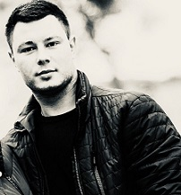

# Vladislav Zinovik
    
## Beginner frontend developer

## Contact information:
   - **Phone:** +375 29 127-44-37
   - **E-mail:** visper.vl@gmail.com
   - **GitHub:** [vladislavzinovik](https://github.com/vladislavzinovik)
   - **Telegram:** [@vladislavzinovik](https://t.me/vladislavzinovik)
   - **Discord:** [vladislavzinovik#6894](https://discord.gg/FeU3qJq8wH)

## About Myself:
_Beginner frontend developer. The Rolling Scopes School Student._ \
_Belarus. Minsk. 26 years._

## Skills:
- HTML
- CSS
- JavaScript
- Git, GitHub
- VS Code  
- Adobe Photoshop

## Code example:
```javascript
const func = (num) => {
  if (num > 0) {
    return num - 1;
  }
  return num + 1;
};
```

## Education
 - #### University: Belarusian National Technical University
 - #### Courses:
   - RS Schools Course «JavaScript/Front-end. Stage 0» (in progress…)

## Languages:
 - English - Intermediate
 - Russian - Native